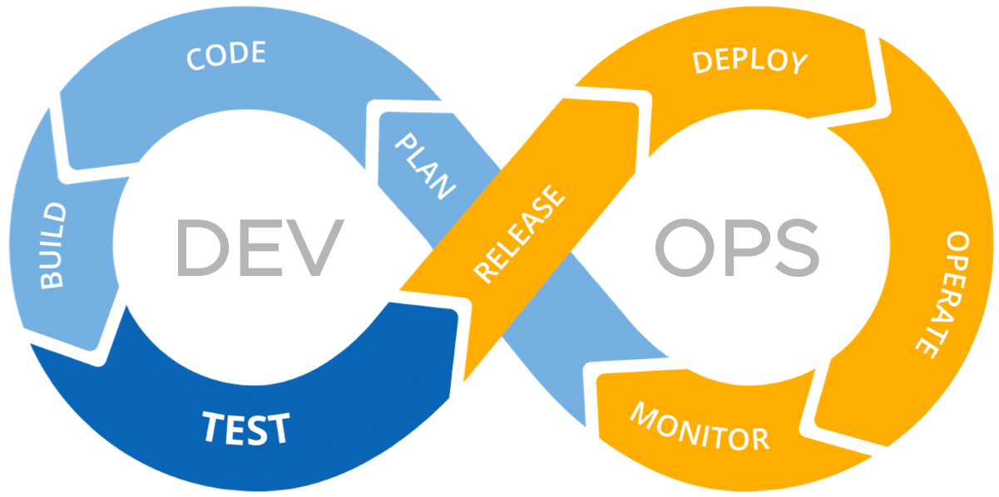

# DevOps - Modern Softzware Development

[cosipy](https://github.com/cryotools/cosipy)  
[velosaurus](https://github.com/OliverZott)  
[velosaurus repo](https://github.com/OliverZott/velosaurus-backend)  
[velosaurus project](https://github.com/users/OliverZott/projects/5)  

<!--  -->
<!--  -->

<http://blogs.vmware.com/management/files/2020/03/2020-03-02_14-18-57.png>

<!-- [DevOps Lifecycle Pic2](https://wac-cdn.atlassian.com/dam/jcr:ef9fe684-c6dc-4ba0-a636-4ef7bcfa11f1/New%20DevOps%20Loop%20image.png?cdnVersion=1581) -->

## Stages of the DevOps Lifecycle

### 1. Plan

General:

- Define the project scope, requirements, and objectives  
- Identify the resources required to complete the project.
- Create a project timeline and assign tasks to team members.

Using...

- **Srum** process

  - **Refinement**: Product Owner and Development Team refine the Product Backlog
  - **Sprint Planning**: Development Team selects items from the Product Backlog to include in the Sprint
  - **Daily Scrum**: Development Team meets daily to discuss progress and plan the next 24 hours
  - **Sprint Review**: Development Team demonstrates the work done during the Sprint
  - **Sprint Retrospective**: Development Team reflects on the Sprint and identifies improvements

  - **Sprint**: Time-boxed period during which the Development Team works to deliver a potentially releasable product increment
  - **Product Backlog**: List of all desired work on the project
  - **Scrum Team**: Product Owner, Development Team, Scrum Master, QA, etc.

- DevOps Tools like Jira, Trello, Asana, GitHub Projects, Azure etc.

### 2. Code

- Git (GitFlow) / Pull Requests / Code Reviews
  - **GitFlow**: Branching model for Git that helps teams manage code changes and releases.
  - **Pull Requests**: Request for code review and merging code changes into the main branch.
  - **Code Reviews**: Review code changes with team members to ensure quality and consistency.
- Unit Testing
  - **Unit Testing**: Write automated tests to verify the code works as expected.
- Tools (Linter, Import sorter, formatter, type hints)
  - **Linter**: Tool that analyzes code for potential errors and style issues.
  - **Import Sorter**: Tool that organizes import statements in code files.
  - **Formatter**: Tool that formats code according to a specific style guide.
  - **Type Hints**: Annotations that specify the data types of variables and function parameters.

### 3. Build

- Compile the code into executable files.

### 4. Test

- Run automated tests to verify the code works as expected.
- Identify and fix any bugs or issues in the code.

### 5. Release / Deploy / Operate = CI/CD

- Deploy the code to a production environment.
- Monitor the code in the production environment.

#### 5.1 Pipelines

CI / CD Pipelines automate the process of building, testing, and deploying code changes.

- **Continuous Integration (CI)**: Practice of integrating code changes into a shared repository frequently. CI pipelines automate the process of building and testing code changes.
- **Continuous Deployment (CD)**: Practice of automatically deploying code changes to production environments. CD pipelines automate the process of deploying code changes to production.

- e.g.
  - Unit Tests / Code Coverage
  - Static Code Analysis (Ruff/SonarQube)
  - Build / Package  -> PyPi package / Nuget package / Docker image
  - Deploy / Release -> PyPi feed, DockerHub, Cloud

#### 5.2 Containerization

Process of packaging an application and its dependencies into a container.

- WSL / Docker
  - `wsl`
  - `cat /etc/os-release`

- **Docker**: Tool that simplifies the process of creating, deploying, and running containers
  - VMs: Virtual Machines emulate physical computers within a host machine. Each VM instance has its own guest operating system, and applications run inside this isolated environment.
  - Docker Containers: Containers do not boot up their own guest OS. Instead, they run on top of the host operating system
  - Containers provide process isolation. By using a Linux distribution within a container, you can encapsulate your application and its dependencies, ensuring that it runs consistently across different environments.
  - This isolation allows you to package everything needed for your application (libraries, binaries, configuration files) into a single unit—the container image. You can then move this image between different hosts or cloud platforms without worrying about compatibility issues.
  - The container runtime (like Docker) provides an abstraction layer that bridges the gap between the application and the host kernel.

- **Kubernetes**: Container orchestration platform that automates the deployment, scaling, and management of containerized applications. Using Ingres and Kong for API Gateway.
- **Ingress**: Kubernetes resource that manages external access to services within a cluster.
- **Kong**: Open-source API Gateway and Microservices Management Layer, delivering high performance and reliability.
- **auto-scaling** and **load balancing** are used to manage workloads, auto-scaling adjusts the number of running instances based on load, and load balancing distributes traffic to those instances.

### 8. Monitor

- Monitor the code in the production environment to identify and fix any issues that arise.
- Tools: Monitoring tools (Azure Monitor, Grafana, Prometheus, Sentry)
  - Sentry: Open-source error tracking tool that helps developers monitor and fix crashes in real-time.
  - Prometheus: Open-source monitoring and alerting toolkit that collects metrics from various systems and stores them in a time-series database.

--------

## Example - PyPI

- Sign Issue to project and estimate
- Create a branch
- Fix using AI and also unittest
  - Fix with adding unused variables to force ruff error in pipeline
  - Adapt unittest (float instead int with assertAlmostEqual)
  - increment version number
  - pipeline fix ruff src AND tests
- Push and create PR
- make code review
- merge and check new version in PyPI

--------

## DevOps Principles

1. **Collaboration**: DevOps encourages collaboration between development and operations teams to improve communication and efficiency.

2. **Automation**: DevOps relies on automation to streamline the software development process and reduce manual errors.

3. **Continuous Integration**: DevOps promotes continuous integration, where developers integrate their code changes into a shared repository frequently.

4. **Continuous Deployment**: DevOps enables continuous deployment, where code changes are automatically deployed to production environments.

5. **Monitoring**: DevOps emphasizes monitoring and logging to track the performance of software applications and identify issues quickly.

6. **Feedback**: DevOps encourages feedback from users and stakeholders to improve software quality and performance.

## DevOps Tools

1. **Version Control Systems**: Git, Subversion, Mercurial
2. **Continuous Integration Tools**: Jenkins, Travis CI, CircleCI
3. **Configuration Management Tools**: Ansible, Puppet, Chef
4. **Containerization Tools**: Docker, Kubernetes
5. **Monitoring Tools**: Nagios, Prometheus, Grafana
6. **Logging Tools**: ELK Stack (Elasticsearch, Logstash, Kibana), Splunk
7. **Collaboration Tools**: Slack, Microsoft Teams, Jira
8. **Cloud Platforms**: AWS, Azure, Google Cloud

## Links

<https://www.browserstack.com/guide/devops-lifecycle>
<https://blog.hubspot.com/website/what-is-devops>

<https://www.atlassian.com/devops>
